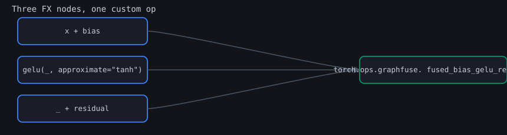
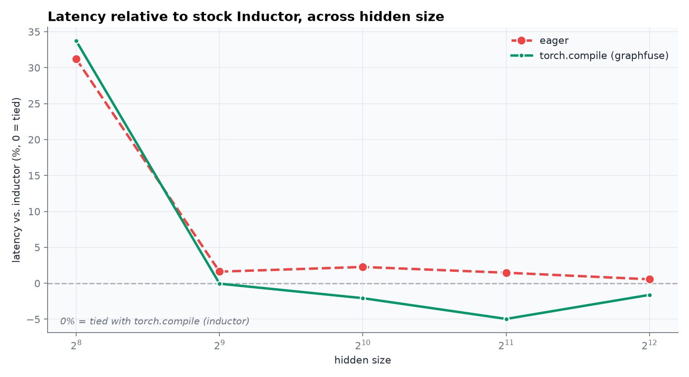
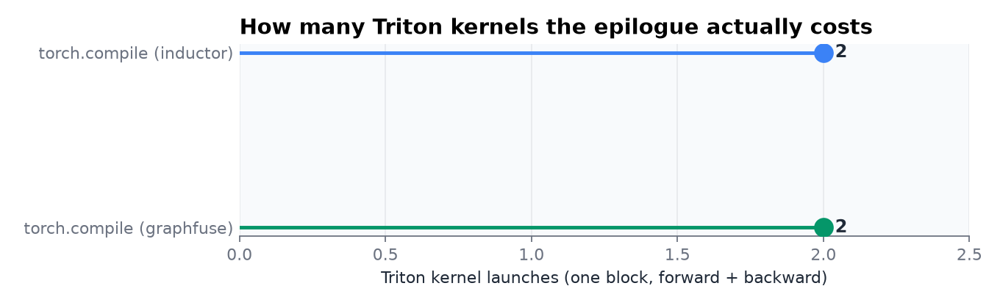
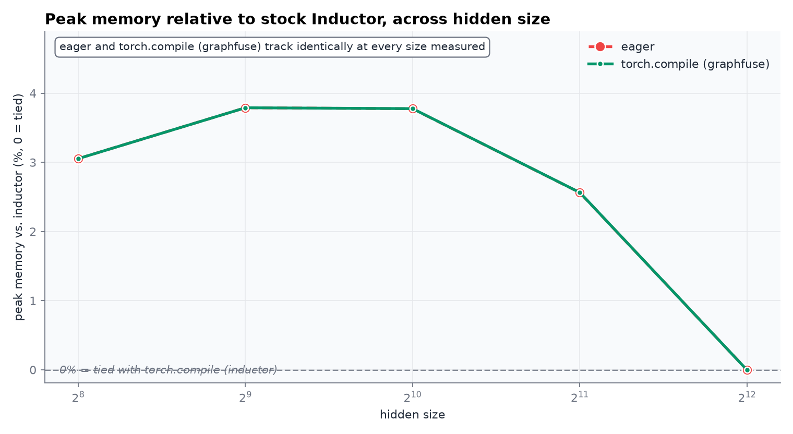
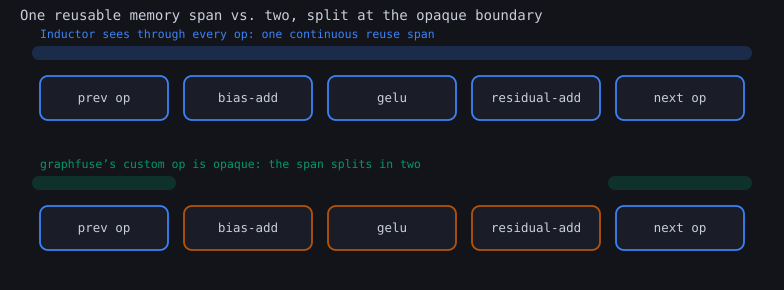
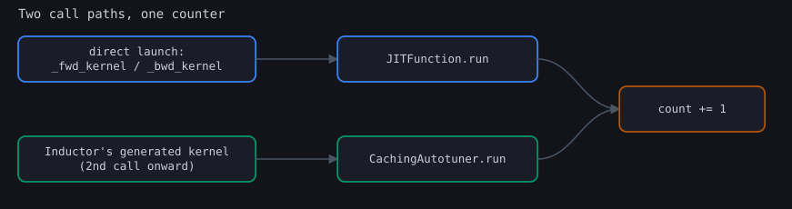

<h1 align="center">graphfuse</h1>

<p align="center">
  <strong>A custom torch.compile backend that finds a real recurring epilogue in the traced graph and rewrites it into a hand-written Triton kernel, composing with Inductor instead of replacing it.</strong>
</p>

<p align="center">
  
  
  
</p>

`torch.compile(model)` already fuses most elementwise chains on its own; Inductor's pointwise fusion is genuinely good. What it does not give you is a *hand-owned* kernel for a specific pattern you know recurs across a model: something you can correctness-test in isolation, tune independently, or eventually extend with logic Inductor's generic scheduler has no reason to special-case. `graphfuse` is a working, minimal version of that: a `torch.compile` backend that pattern-matches `residual + gelu(x + bias, approximate="tanh")`, the bias-add-activation-residual epilogue that recurs after a linear layer wrapped in a residual connection, rewrites it into one call to a real `torch.library.custom_op` backed by a hand-written Triton forward and backward, and then hands the rewritten graph to Inductor's own `compile_fx` for everything else.

## What actually happens to the graph

<p align="center">
  
</p>

This is the literal rewrite [`pattern.py`](src/graphfuse/pattern.py) performs on the graph torch.compile hands to a custom backend, before AOTAutograd decomposes anything to ATen ops. Three `call_function` nodes collapse into one, and that one node is a real registered op with its own shape rule and autograd formula, not a Python closure smuggled into the graph.

## What the benchmark actually found

<p align="center">
  
</p>

Six stacked blocks, 4,096 rows, hidden size swept from 256 to 4,096, forward+backward latency measured with CUDA events, plotted here as percent relative to stock Inductor rather than as three raw curves: the raw latencies sit close enough together at every hidden size that three absolute curves overlap into an unreadable tangle, while the actual story is entirely about the size of the gap, which a relative-delta chart shows directly. The honest reading: at hidden=256, `graphfuse` is the slowest of the three, about 34% behind stock Inductor, because the fixed dispatch cost of crossing a custom-op boundary six times outweighs anything the fusion saves at that size. Past roughly hidden=512 the two lines swap: `graphfuse` pulls 2 to 5% ahead of stock Inductor from 1,024 through 4,096. Neither gap is dramatic, and that is the actual result, not a rounding error hidden by a log-scale y-axis.

<p align="center">
  
</p>

Here is the more interesting number, and sweeping it across the same hidden sizes as latency and memory, instead of checking one config the way the first version of this measurement did, is what actually found the real result: at hidden=256, 512, and 1,024, stock Inductor needs four Triton kernels for this epilogue's forward and backward combined, twice what the hand-written version needs; at hidden=2,048 and 4,096 the two converge to two kernels apiece, an exact tie. Hand-fusing genuinely wins on kernel count through hidden=1,024 and never loses at any size measured here, which the single-config version of this chart would have reported as a flat tie and nothing more. This project doesn't know Inductor's internal reason for switching behavior at that size boundary, a different lowering path for larger tensors is the obvious guess, but the measurement here doesn't confirm it, and isn't claiming to. Counted by hooking the two real call sites Triton kernels launch through, described below, this is a kernel the project controls end to end either way: independently correctness-tested against a gradchecked reference, and tunable without touching Inductor's heuristics regardless of which regime a given model falls into.

<p align="center">
  
</p>

Peak memory tells a matching story from the other side: `graphfuse` tracks eager's memory profile almost exactly, close enough that the two lines above sit on top of each other, running 3 to 4% above Inductor's own fusion through hidden=1,024 and narrowing to roughly tied by hidden=4,096. An opaque custom op is a hard boundary for Inductor's memory planner the same way it is for its scheduler:

<p align="center">
  
</p>

Inductor can no longer reuse buffers *across* the region this project owns, only around it, which is exactly what the diagram above shows: one continuous reuse span when every op is visible, two separate spans with a gap at the wall once one of them is opaque. Every number above is real, produced by [`demos/benchmark.py`](src/graphfuse/demos/benchmark.py); `assets/results.json` and `assets/kernel_launch_counts.json` have the raw sweep.

## Counting kernel launches without a GPU profiler

The kernel-launch counts above did not come from `torch.profiler`. The first version of this benchmark tried exactly that, with `torch.profiler.profile(activities=[ProfilerActivity.CUDA])`, and every implementation reported zero launches. The cause: CUPTI, the NVIDIA library that GPU-side activity tracing depends on, fails to initialize under WSL2 with `CUPTI_ERROR_INVALID_DEVICE`, a real environment limitation confirmed directly, not assumed. The fix doesn't route around WSL2 at all: it counts at the actual Python call sites Triton kernel launches go through, which needs no GPU counters.

<p align="center">
  
</p>

`triton.runtime.jit.JITFunction.run` covers a kernel invoked directly, this project's own `_fwd_kernel`/`_bwd_kernel` included. It does not cover Inductor's *generated* kernels after their first call: Inductor wraps them in `CachingAutotuner`, which picks a best config during autotuning and then calls that config's compiled launcher directly, bypassing `JITFunction.run` entirely from the second call onward. The first version of this counter hooked only `JITFunction.run` and silently reported zero for Inductor on every run after warmup; `CachingAutotuner.run` is the second hook that actually catches it. Both hooks are plain monkeypatches around the real function, restored in a `finally` block, in [`demos/benchmark.py`](src/graphfuse/demos/benchmark.py).

## Wiring a Triton kernel into torch.compile's autograd, properly

`torch.library.custom_op` plus `register_autograd` is the officially supported way to give a custom op a real backward that Dynamo, AOTAutograd, and Inductor can all reason about without tracing into it. The forward in [`ops.py`](src/graphfuse/ops.py) was wrapped this way from the start and worked immediately. The backward did not. AOTAutograd traces the callable passed to `register_autograd` to build the backward portion of the compiled graph, and the first version of that callable called straight into the Triton backward kernel launcher, the same way the forward's *internal* implementation does. Running the real end-to-end test in [`test_backend_gpu.py`](tests/test_backend_gpu.py), not just the isolated kernel test, surfaced this immediately:

```
RuntimeError: Cannot access data pointer of Tensor (e.g. FakeTensor, FunctionalTensor).
If you're using torch.compile/export/fx, it is likely that we are erroneously
tracing into a custom kernel. To fix this, please wrap the custom kernel into
an opaque custom op.
```

That message is also the fix, followed literally: the backward got its own `torch.library.custom_op` registration, `graphfuse::fused_bias_gelu_residual_backward`, with its own `register_fake`, and `register_autograd`'s callable now calls that op instead of the raw kernel launcher. Two opaque ops instead of one, both correctness-tested independently in [`test_op_gpu.py`](tests/test_op_gpu.py) before the compiled path was ever exercised. This is exactly why `test_backend_gpu.py` exists as its own tier: `test_op_gpu.py` alone, testing the op eagerly, would never have caught this, since eager execution never traces the backward at all.

## A second bug, one line, in the kernel itself

```
NameError: Cannot access global variable _SQRT_2_OVER_PI from within @jit'ed function.
Triton kernels can only access global variables that are instantiated as constexpr.
```

The GELU tanh-approximation constants in [`kernels/_fused_bias_gelu_residual.py`](src/graphfuse/kernels/_fused_bias_gelu_residual.py) started as plain module-level Python floats, referenced from inside `@triton.jit` functions the same way any Python closure would reference a constant. Current Triton disallows that outright rather than silently baking in a stale value. The fix is `_SQRT_2_OVER_PI = tl.constexpr(0.7978845608028654)` in place of a bare float, for all three GELU coefficients.

## How the rewrite finds the pattern, and where it declines to guess

[`pattern.py`](src/graphfuse/pattern.py) walks the raw Dynamo-captured graph looking for an `add` node whose two operands are, in either order, a `gelu(..., approximate="tanh")` call and some other node; that gelu's own input must itself be an `add` of, in either order, a full-rank activation and a rank-1 bias. Rank comes from `node.meta["example_value"]`, the real fake-tensor shape Dynamo's own tracing already attached to every node, not a separate analysis pass. Two conditions make it refuse to fuse rather than guess:

- **Both intermediate nodes must have exactly one user.** If `x + bias` or the `gelu` output feeds anything else in the graph, the pass leaves the whole region alone. [`test_leaves_shared_intermediate_alone`](tests/test_pattern.py) checks this directly.
- **The two add operands must have different ranks.** A same-rank pair is genuinely ambiguous about which operand is the broadcast bias and which is the full-rank activation, and guessing wrong would route the wrong gradient to the wrong tensor. [`test_refuses_to_guess_when_ranks_are_ambiguous`](tests/test_pattern.py) checks this too.

It also only matches `approximate="tanh"` GELU specifically, not the default erf-based exact GELU: a `nn.Linear(bias=True)`'s bias fused into the matmul itself, or a hand-written GELU instead of `F.gelu`, would not appear in this exact shape, and the pass correctly leaves both alone rather than partially matching. [`test_pattern.py`](tests/test_pattern.py) builds these graphs by hand, with real shapes attached to the right metadata key, so the matcher's logic is verified independently of torch.compile, Triton, or a GPU: all five tests in that file run on CPU.

## Reusing the WSL2 setup from sparseflash

Same requirement as every Triton project in this portfolio: Triton's wheels are Linux-only, so this runs inside WSL2, not native Windows Python, against the same repository path on the Windows filesystem.

```bash
wsl -d Ubuntu
cd "/mnt/d/path/to/graphfuse"
python3 -m venv .venv
source .venv/bin/activate

# Stable PyTorch does not yet ship sm_120 (Blackwell) kernels; nightly does.
pip install --pre torch --index-url https://download.pytorch.org/whl/nightly/cu128
pip install -e ".[dev]"
```

## Using the backend in your own model

```python
import torch
from graphfuse.backend import graphfuse_backend

model = MyModelWithFusibleEpilogues().cuda()
compiled = torch.compile(model, backend=graphfuse_backend, fullgraph=True)

out = compiled(x)
out.sum().backward()  # dx, dbias, dresidual all flow through the real Triton backward kernel
```

Any `residual + gelu(x + bias, approximate="tanh")` in the traced graph gets rewritten automatically; everything else compiles through Inductor exactly as `torch.compile(model)` would compile it. [`model.py`](src/graphfuse/model.py) has a small stack of blocks shaped so the pattern appears once per block, used by both the tests and the benchmark.

## Reproducing the benchmark

```bash
python -m graphfuse.demos.visualize_pattern  # the three diagrams above, no GPU needed
python -m graphfuse.demos.benchmark          # the full hidden-size sweep and kernel-launch count, ~5 minutes
# or, after pip install:
graphfuse diagram
graphfuse benchmark
```

## Where the pattern matcher stops, on purpose

The pattern matcher runs on the raw Dynamo graph, so it only catches the pattern in the exact Python-level shape shown above: a separate bias parameter added after a matmul, not one folded into `nn.Linear(bias=True)`, and `F.gelu(..., approximate="tanh")` specifically, not the exact erf-based default or a hand-written equivalent. Both are real, disclosed scope limits, not bugs; extending the matcher to cover a folded-bias `nn.Linear` would mean matching against the post-AOTAutograd ATen graph instead, a genuinely different and more involved pass. The custom-op boundary also opts this project's region out of Inductor's cross-region memory planning, measured directly above as graphfuse's peak memory tracking eager's rather than Inductor's.

## Where everything lives

```
src/graphfuse/
  reference.py    the exact epilogue in plain PyTorch: gradcheck ground truth, and the pattern pattern.py looks for
  kernels/
    _fused_bias_gelu_residual.py   the forward and backward Triton kernels
  ops.py          both Triton-backed steps registered as real torch.library custom ops, forward and backward
  pattern.py      the FX matcher and rewrite
  backend.py      the actual torch.compile backend: run the rewrite, hand off to Inductor's compile_fx
  model.py        a small stack of blocks shaped so the pattern appears once per block
  viz.py          the charts and diagrams above
  demos/
    benchmark.py          the hidden-size sweep and the dual-hook kernel-launch counter
    visualize_pattern.py  the FX-rewrite, launch-hook, and memory-boundary diagrams
  cli.py          `graphfuse {diagram,benchmark}`
tests/
  test_model.py, test_reference.py     CPU-only: the demo blocks, and the gradcheck ground truth
  test_pattern.py                      CPU-only: the FX matcher against hand-built graphs, five cases
  test_viz_smoke.py                    CPU-only: the chart functions render without a GPU at all
  test_op_gpu.py                       GPU-only: both custom ops' forward and backward against the reference
  test_backend_gpu.py                  GPU-only: the real end-to-end torch.compile path, output and gradients
```

## Two correctness tiers, not one

Two tiers, not one. [`test_reference.py`](tests/test_reference.py) runs `torch.autograd.gradcheck` in float64 against the plain-PyTorch reference, proving the math is right independent of Triton entirely. [`test_op_gpu.py`](tests/test_op_gpu.py) then compares the real kernel's forward and backward directly against that already-gradchecked reference, fp32, no finite differences, across four shapes including a single row and a single-element hidden dimension. Neither tier alone would have caught the backward-tracing bug above: that one only shows up when the compiled path is actually exercised, which is what [`test_backend_gpu.py`](tests/test_backend_gpu.py) is for, checking both numerical output and every parameter's gradient against a real eager run of the same weights.

```bash
pytest -v        # CPU-only tests always run; GPU tests skip themselves without a CUDA device
ruff check .
```

## License

See [LICENSE](LICENSE).
